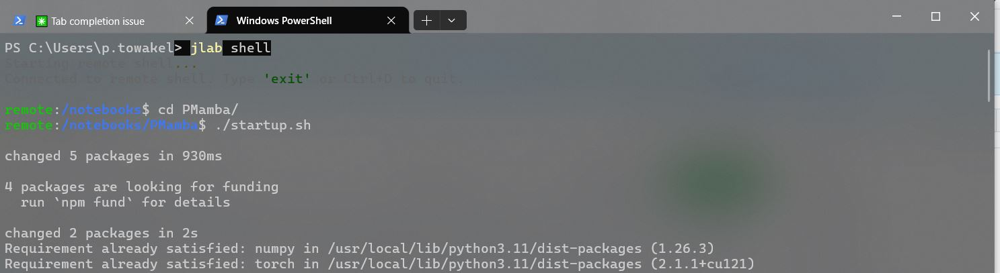

# jlab

A CLI tool to interact with remote JupyterLab instances from your terminal. Connect to any JupyterLab server and get a full remote shell, run code, manage files, and execute notebooks -- all without opening a browser.



## Installation

```bash
git clone https://github.com/PraveerT/Anemon.git
cd Anemon
pip install -e .
```

## Quick Start

```bash
# Connect to your JupyterLab server
jlab connect https://your-server.com --token YOUR_TOKEN

# Open a remote shell
jlab shell
```

## Commands

| Command | Description |
|---------|-------------|
| `jlab connect <url> --token <t>` | Save connection to a JupyterLab server |
| `jlab shell` | Remote shell with tab completion and streaming output |
| `jlab status` | Show server status |
| `jlab ls [path]` | List remote files and directories |
| `jlab cat <path>` | View file contents with syntax highlighting |
| `jlab upload <local> <remote>` | Upload a file to the server |
| `jlab download <remote> [local]` | Download a file from the server |
| `jlab rm <path>` | Delete a remote file |
| `jlab kernels` | List running kernels |
| `jlab run "<code>"` | Execute code on a remote kernel (one-shot) |
| `jlab repl` | Interactive Python REPL on a remote kernel |
| `jlab nb run <notebook>` | Run all cells of a remote notebook |

## Remote Shell

`jlab shell` gives you a terminal on the remote machine, similar to SSH:

- Real-time streaming output (line-by-line, not buffered)
- Tab completion for files and directories on the remote server
- `cd` to navigate the remote filesystem
- `clear` to clear your terminal
- Colored prompt showing remote working directory
- Ctrl+D or `exit` to disconnect

```
remote:/notebooks$ ls
PMamba  REQNN  paper  research  viz-qcc
remote:/notebooks$ cd PMamba
remote:/notebooks/PMamba$ ./startup.sh
changed 5 packages in 930ms
...
```

## How It Works

jlab connects to JupyterLab's REST API and WebSocket kernel protocol:

- **File operations** use the `/api/contents/` REST endpoints
- **Code execution** uses WebSocket connections to `/api/kernels/{id}/channels` with the Jupyter messaging protocol
- **Remote shell** runs commands via `subprocess.Popen` on a Python kernel, streaming output back over WebSocket in real-time
- **Tab completion** queries the remote filesystem through the kernel
- **Config** is stored in `~/.jlab/config.json`

## Dependencies

- [click](https://click.palletsprojects.com/) - CLI framework
- [requests](https://requests.readthedocs.io/) - REST API calls
- [websocket-client](https://websocket-client.readthedocs.io/) - Kernel WebSocket communication
- [rich](https://rich.readthedocs.io/) - Terminal formatting
- [prompt_toolkit](https://python-prompt-toolkit.readthedocs.io/) - Input with tab completion
